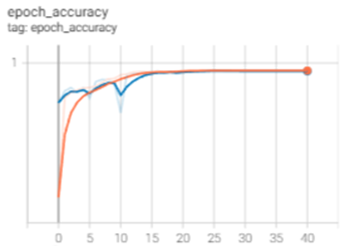
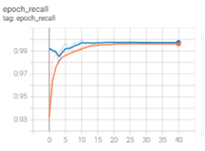

# Inspection of concrete structures

## Mission objectives

- Application of deep learning models for the analysis of images.
- Explore Deep Learning libraries: (Tensorflow, PyTorch, etc...).
- Explore other AI approaches that might be useful to identify the cracks and associated geometry.

## The Mission

The client is a construction company using drones to inspect the structures built with concrete. The use of drones allows them to collect a significant amount of pictures of concrete walls, bridges, and concrete decks. The use of drones is helpful because it facilitates the inspection of places with difficult access. However, it also implies the manual inspection of hundreds or thousands of images to identify cracks that might be present on the concrete surface.

It is fundamental for the company to detect even smaller cracks to correct the problem before the appearance of severe structural damage. The next step in the project will be to develop an algorithm that identifies the crack and its length (in mm or cm) to categorize the severity and take immediate action according to it.


### About the Project 

Millions of dollars are being invested on new constructions but if the maintainance is not done properly it could cost more millions. This cost can be minimized if the detection of cracks will be found as earlier as possible. 

To be able to achieve this crack images from [kaggle](https://www.kaggle.com/datasets/arunrk7/surface-crack-detection) are split in to train, validation and test sets with the help of library splitfolders. In total there are 40000 images. 

Metrics used during training the model are: 

    BinaryAccuracy  
    Precision  
    Recall  

Model has 3 Conv2d layers with maxpooling after each convolutional layers. It ends with a flat layer and 1 noron Dense layer. For early stopping val_loss is checked for 8 patience. Again learning rate reduced after 3 patience steps for val_loss. Images used in detectien were quite clean so the accuracy on testset vas %99.


Callbacks:  

        Early stopping patience=8 
        Learning rate patience=3
        tensorboard

After 35 epocs accuarcy stabilised. Results were impressive. The reason is data used here is very clean.  






## installation
```
docker-compose build
docker-compose up
```


## App on heroku
https://cementcr.herokuapp.com/


## Repo Architecture
```
│ README.md           : This file
│ app.py              : Flask app start
│ util.py             : some utility functions
│ Dockerfile          : Docker file
│ docker-compose.yml  : Docker file
| requirements.txt    : Requirements file
| cement.ipynb        : Model creation in more detailed 
| modelc.py           : Model creation script 
| crack.py            : Location of the crak with opencv  
|___
│ data_concreate      : data folder for images
│ │ : DOWNLOADED FROM KAGGLE
│___
| model
│ │ modelbm.h5        : Weights of the model
│ │ modelbm.json      : Model structure
│___
| templates
│ | base.html         : Template for flask
│ | index.html        : Template for flask
│___
| static
│ | main.css          : css file for flask app
│ | main.js           : javascript file used in app 
│___
| visuals
| | : images used in readme file
  
```


crack location script wriiten by [Hao Cheam](https://github.com/chc442/Crack-Detection)


_The imperial vastness of late Roman architecture was made possible by the invention of concrete._
-Iain McGilchrist

